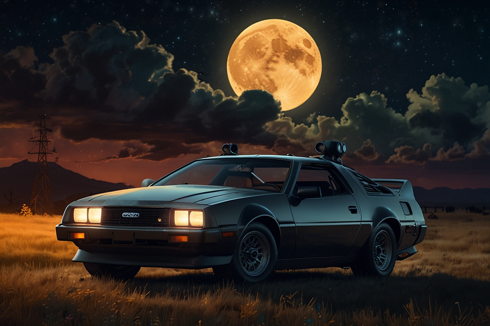

<p align="center">

</p>

# Vídeo: Explorando as ferramentas IAs Generativas

## 📒 Descrição
Este pequeno vídeo apresenta uma visão rápida e envolvente do potencial e da aplicação das IAs Generativas.

## 🤖 Tecnologias Utilizadas


- [ChatGPT](https://chat.openai.com/) 
- [Leonardo.ai](https://leonardo.ai/)
- [Heygen](https://app.heygen.com/)
- [ElevenLabs](https://beta.elevenlabs.io/)
- [Capcut](https://www.capcut.com/pt-br/)


## 🧐 Processo de Criação

- Leonardo.ai -> Imagem

```
Rural environment at night with starry sky and a full moon of unique artistic anime with beautiful lighting and color theory in the style of studio Ghibli mixed with the style of Frank Frazetta. Car styled from the movie Back to the Future with fire effect on the rear wheels.
```

- ChatGPT -> Roteiro
```
Você é um roteirista de podcast, e vamos criar um  roteiro de um podcast de tecnologia, 
focado em frontend e acessibilidade na web cujo o nome é "De Volta para o Front End - Desvendando a Acessibilidade na Web" 
e tem foco em frontend e acessibilidade na web,  com o público alvo de iniciantes em frontend , 
o formato do roteiro deve ser

[INTRODUÇÃO]
[CURIOSIDADE]
[FINALIZAÇÃO]

{REGRAS}

- no bloco [INTRODUÇÃO] substitua por uma introdução iguais as introduções dos vídeos do canal 'Rockeseat', como se fossem escritos pelo Diego Fernandes
- no bloco [CURIOSIDADE] substitua por uma curiosidade de acessibilidade na web
- no bloco [FINALIZAÇÃO] substitua por uma despedida cool com o final 'Eu sou a Paty e esse foi o De Volta para o Front End dessa semana'
- use termos de fácil explicação
- O podcast vai ser apresentado somente por uma pessoa, chamada Paty
- O podcast deve ser curto

{REGRAS NEGATIVAS}

- Não use muitos termos técnicos
- Não ultrapasse 1 minutos de duração
```

- ElevenLabs -> Áudio

- Heygen -> Vídeo do Avatar

- CapCut -> Tratar áudio, adicionar imagens e adicionar som de fundo

## 🚀 Resultados

- Imagem, Áudio e Vídeo utilizados em assets 
- Vídeo final em output

## 💭 Reflexão (Opcional)
Foi muito interessante o desafio e tentei utilizar o máximo de ferramentas IAs.
